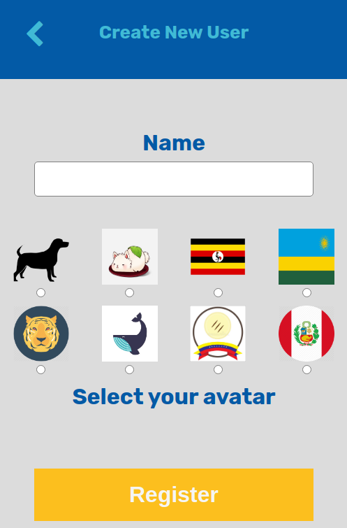
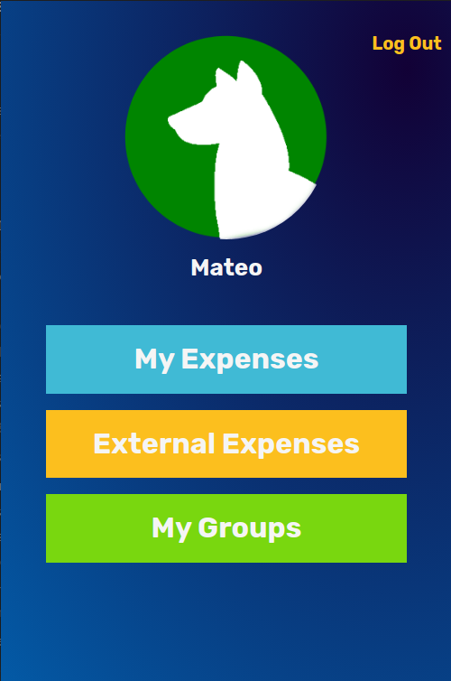
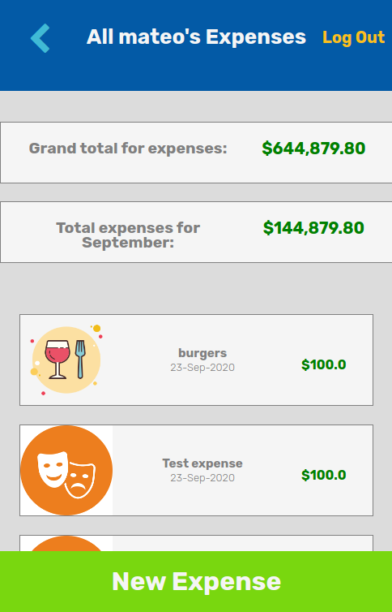
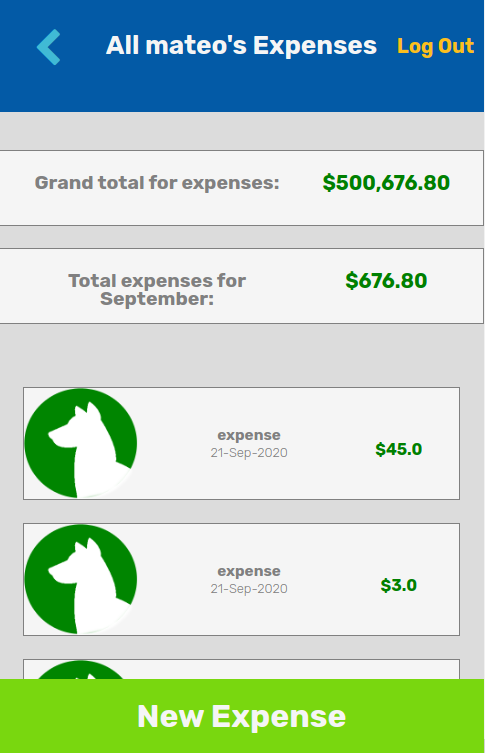
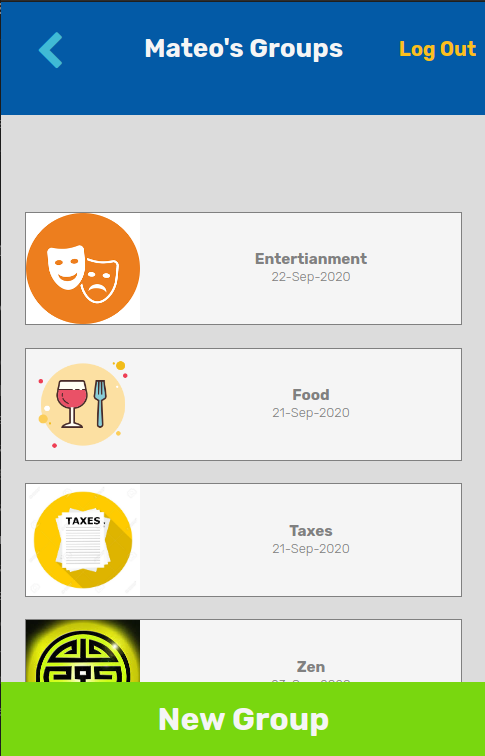
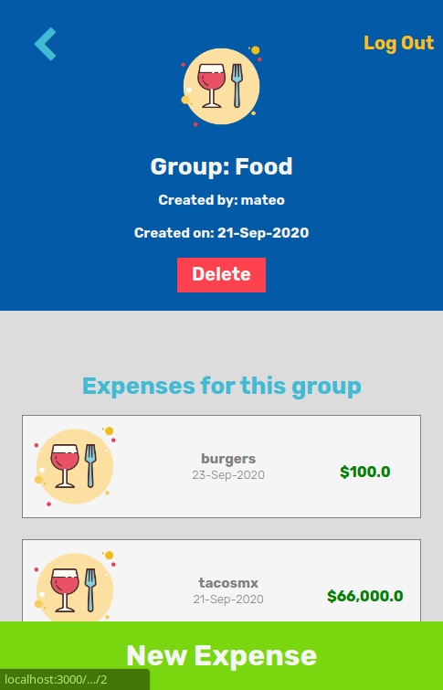
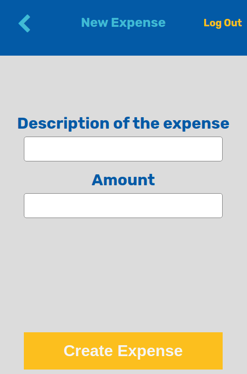

# Money Monster

> This project is an expense tracker where you can enter every expense that you make as independent, or you can group expenses by category.


This project is a Capstone Project for the Microverse Rails technical curriculum. The idea is to make the backend and the front end of the application to keep track of the expenses a user makes. The expenses can be stand-alone or by a group and the app allows the user to create new groups and new expenses for them or create a stand-alone expense. 

## Built With

- Ruby
- Rails
- HTML
- CSS


# How to use it

The application welcomes you by giving you the option to sign in if you are a registered user or to register if you are new to the app, the only thing it asks for is your name to start keeping track of your expenses.



Once you are logged in you will be welcomed by your profile page where you can see the avatar that you selected in the registration, your name, and 3 options to navigate the app.



The **My Expenses** page will show you all the expenses that the user has registered and next to each expense will show the icon of the group that it belongs to, if it doesn't have any group associated to it, will show the user avatar.



The **External Expenses** shows you all the expenses that are not associated with a group, aka stand-alone expenses.



In both pages, it will show, before listing any expense, the total amount spent on the listed expenses as well as the total amount spent for the month.

Then we have the **My groups** page where the user can see all the groups created by him/her with their respective icon.



If you click on any of the groups, it will show its information and the list of the expenses associated with it.



At the top of the page, you will find the navigation buttons with them you can either go back a page or logout from the application.


On every page at the bottom, the user can find the **new button** to create either a group or an expense depending on the page he/she is on.



The app will let you know if there are any errors while creating a user, group, or expense, via a message on the top of the screen.

That is pretty much what you need to know on how to use the app, just start playing with it and let us know of any issues you can find.


## Live Demo

[Try it out here!!!!](https://livedemo.com)


# Setup

### Install before you start

To run the app you need to install RUBY on your computer. For windows, you can go to [Ruby installer](https://rubyinstaller.org/), for MAC and LINUX you can go to [Ruby official site](https://www.ruby-lang.org/en/downloads/) for instructions on how to install it.

After installing ruby, run the following command to install RAILS

```
gem install rails -v 5.2.3
```

And you can verify that is properly installed by running

```
rails -v
```

That's it, you are ready to go to the next step.

### Getting ready

Clone the [repository](https://github.com/mateomh/MoneyMonster.git), get into the root project folder, open a terminal there and install the gems required for the project by running.

```
bundle install
```

Then run the creation and migrations for the database to get the project ready for the server.

```
rails db:create

rails db:migrate
```
### Run the app

To run the app you should run this command in the terminal that you opened earlier.

```
rails server
```

And then got to your browser and enter the following address in the address bar.

> http://localhost:3000/

And you are ready to go and enjoy the app


## Developer in charge of the project

👤 **Mateo Mojica**
- Github: [@mateomh](https://github.com/mateomh)
- Twitter: [@mateo_m_h](https://twitter.com/mateo_m_h)
- Linkedin: [Mateo Mojica](https://linkedin.com/mateo_mojica_hernandez)


## 🤝 Contributing

Contributions, issues and feature requests are welcome!

Feel free to check the [issues page](issues/).

## Show your support

Give a ⭐️ if you like this project!

## Acknowledgments

- Microverse
- Stackoverflow

## 📝 License

This project is [MIT](https://opensource.org/licenses/MIT) licensed.
